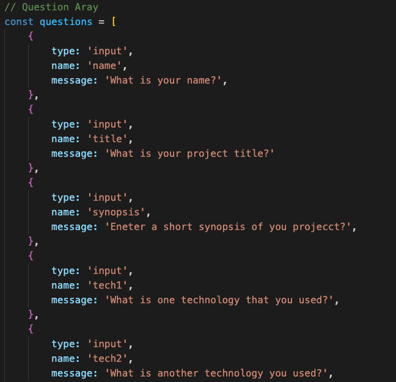
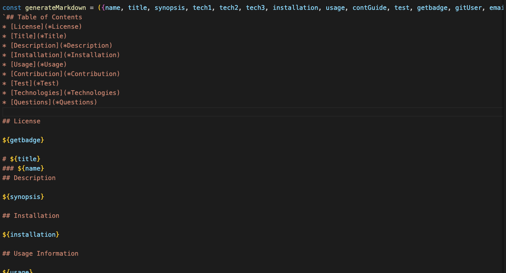
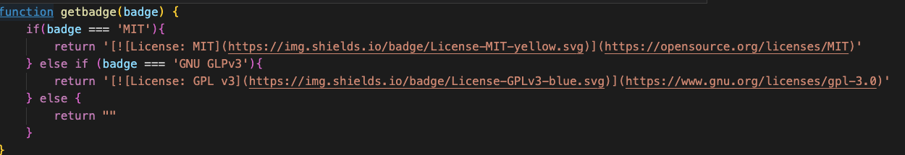
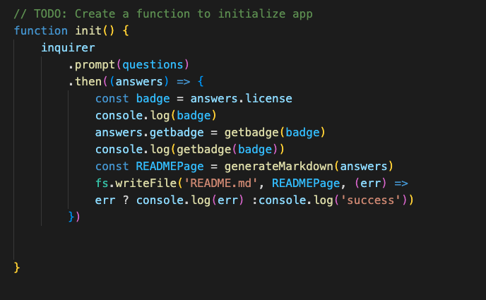

## Table of Contents
* [License](*License)
* [Title](*Title)
* [Description](*Description)
* [Features](*Features)
* [Contribution](*Contribution)
* [Technologies](*Technologies)
* [Questions](*Questions)

## License

# Automated README 
### Grant Ellingotn

im## Description

This program auto generates a README.md file for your projects. It includes standard parts of a a read me file and a Liscense bar to show the liscense.

## Installation

To install, clone the repository and run node index.js to start the program. ounce the program is completed you can open the read me file created.

Here you can find a video to 

## Features

The question array which the prompt will ask.

The `` section which will be written to the readme

The section which generates which chooses the license badge

The below function takes the prompts answers, adds the badge sector to the answers object, and writes the readme file.

## Contribution Guidlines

To constribute, message the creator loacted in the question portion

## Techonologies
Project is created with:
* node .js
* npm inquirer
## Set-up

## Questions
[Grant-Ellington's Git hub](https://github.com/Grant-Ellington)
[gellingtonem6@gmail.com](gellingtonem6@gmail.com))